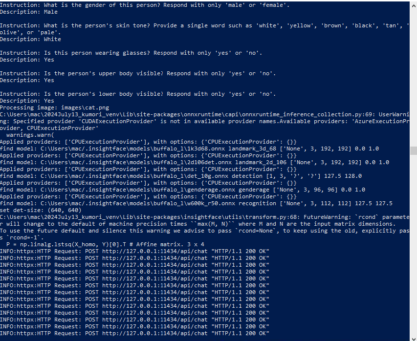
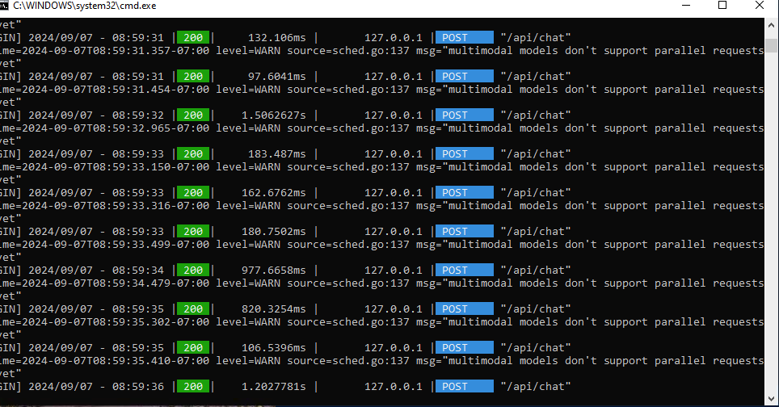
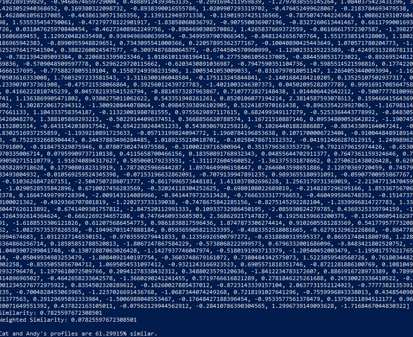

# Ollama Llava13b Facial Analysis App

This app, called the **Ollama Facial Analysis App**, is a sophisticated image analysis tool that processes and analyzes images to generate detailed profiles with facial and contextual features. It uniquely leverages the capabilities of the **llava:13b** model provided by the Ollama AI service to perform local image detection and create JSON maps.

## Main Features

1. **Analyzing Images**
    - Reads images from a specified directory.
    - Uses the **llava:13b** model for local image feature detection such as eye color, hair color, etc.
    - Generates descriptive profiles using AI and stores these profiles in a JSON format.

2. **Comparing Profiles**
    - Compares two generated profiles from JSON files.
    - Calculates similarity between key features of the profiles and provides a similarity score.

3. **Gathering Python Files**
    - Scans the project directory.
    - Gathers all Python file paths and structure.
    - Outputs the collected information to a file for documentation or analysis purposes.

## Unique Use of llava:13b

The Ollama Facial Analysis App stands out due to its unique integration with the **llava:13b** model and the way it utilizes Ollama for enhanced image analysis:

### Local Image Detection with llava:13b

- **High Accuracy Detection**: The app uses the **llava:13b** model to perform highly accurate, local image detection. This model is trained specifically for facial feature recognition.
- **Profile Generation**: By detecting features such as eye color, hair color, facial landmarks, and other physical attributes, the app creates comprehensive JSON profiles for each image.

### Comprehensive JSON Maps

- **Feature Details**: The JSON profiles include detailed data like the color of eyes, hair, facial landmarks, and certainty scores.
- **Contextual Features**: It also captures contextual features such as pose, accessories, and clothing details where applicable.
- **Certainty Estimates**: For many descriptive features, the app calculates the certainty of its responses using follow-up prompts to the **llava:13b** model, ensuring that the details are not only accurate but also reliable.

### Integration of Ollama Service

- **Ollama API**: The app communicates with the Ollama API to generate enhanced descriptions and handle follow-up queries for certainty.
- **Model Management**: The app includes utility functions to manage the installation, setup, and running of the Ollama service and **llava:13b** model.
- **Local Service Management**: Handles starting, stopping, and monitoring the Ollama AI service locally on the machine.

## Example Flow

### Run Image Analysis

1. Execute `analyze_image.py`.
2. The script scans the `images` directory for image files.
3. Uses **llava:13b** to process each image and detect facial features.
4. Stores the analyzed data in `json_profiles` directory.

### Compare Profiles

1. Execute `compare_two_profiles.py`.
2. The script reads two JSON files from `json_profiles`.
3. Compares key features between the two profiles.
4. Outputs the similarity score to the console.

### Documentation

1. Execute `gather_pythons.py`.
2. Scans the directory structure for Python files, excluding some predefined directories.
3. Outputs the structure and paths to a timestamped file.

## Directory Structure

```plaintext
.
├── images
├── json_profiles
├── utilities
│   ├── __pycache__
├── screenshots
├── analyze_image.py
├── compare_two_profiles.py
├── gather_pythons.py
├── README.md (this file)
```

## Python Files

- **analyze_image.py**: Main script for analyzing images.
    - Dependencies: `os`, `json`, `re`, `time`, `datetime`, `PIL`, `ollama_utils`, `standard_image_detection_utils`, `image_utils`, `atexit`.
- **compare_two_profiles.py**: Script for comparing two profiles.
    - Dependencies: `os`, `json`, `difflib`.
- **gather_pythons.py**: Script for gathering Python files and directory structure.
    - Dependencies: `os`, `datetime`.
- **utilities/image_utils.py**: Image utility functions.
    - Dependencies: `PIL`.
- **utilities/ollama_utils.py**: Functions to manage Ollama AI services.
    - Dependencies: `os`, `subprocess`, `shutil`, `platform`, `psutil`, `requests`, `time`, `socket`.
- **utilities/standard_image_detection_utils.py**: Feature detection and extraction functions.
    - Dependencies: `os`, `cv2`, `json`, `pathlib`, `numpy`, `sklearn`, `collections`, `insightface`, `requests`.

## Screenshots



